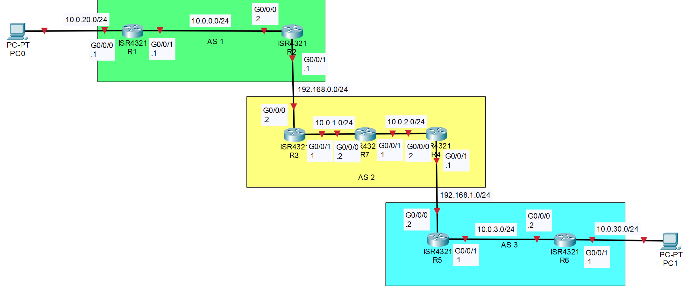
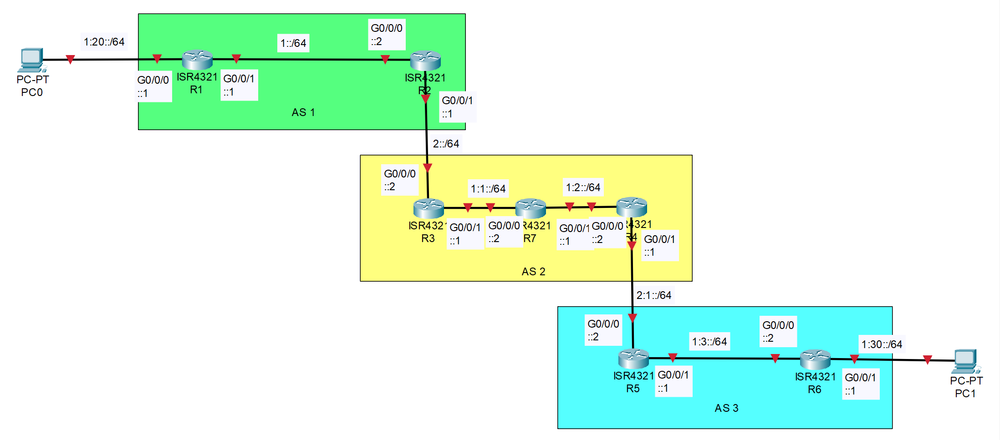

# Internal Border Gateway Protocol Configuration with IPv4 & IPv6

## Contents

1. [**Purpose**](#purpose)
2. [**Background**](#background)
     1. [**Border Gateway Protocol**](#border-gateway-protocol)
     2. [**Other Protocols Used**](#other-protocols-used)
3. [**Summary**](#summary)
4. [**Topology**](#topology)
     1. [**IPv4 Topology**](#ipv4-topology)
     2. [**IPv6 Topology**](#ipv6-topology)
5. [**Address Table**](#address-table)
6. [**Device Overview**](#device-overview)
7. [**ICMPv4 Traceroute Across Network**](#icmpv4-traceroute-across-network)
8. [**ICMPv6 Traceroute Across Network**](#icmpv6-traceroute-across-network)
9. [**IPv4 Routing Table**](#r1-ipv4-routing-table)
10. [**IPv6 Routing Table**](#r1-ipv6-routing-table)

## Purpose
The purpose of this lab is to use internal Border Gateway Protocol (iBGP) to share routes in and out of an autonomous system (AS) by establishing iBGP neighborships. Students will learn how to use route-reflectors, declare iBGP neighbors, and how to use an interior gateway protocol (IGP) to help BGP packets get navigated between iBGP neighbors. Additionally, students will have to have the knowledge of how to redistribute routes and how to use eBGP to route between AS’s. Students will also brush up on skills needed to setup networks with routing protocols, including advertising interfaces, subnetting, and debugging. 

## Background

This is section is background info on key concept/parts of the configuration. It is directed an audience that knows some networking, but their knowledge is limited.

### Border Gateway Protocol
Border Gateway Protocol (BGP) was created in 1989 by Kirk Lougheed, Len Bosack and Yakov Rekhter. eBGP was designed to share routing information between autonomous systems (AS’s), which are often owned by different organizations. iBGP is like a different flavor of eBGP; iBGP, instead of routing between AS’s, provides routes within an AS. This means that iBGP neighbors will have the same AS number. Different from eBGP, iBGP often needs to have an Interior Gateway Protocol (IGP) to help route the packets needed to establish iBGP neighborships. This is because if there are multiple routes to an iBGP neighbor as long as one route is valid to the interface that is used to set up the neighbor session the iBGP neighbor will stay up. As of now BGP has been updated since 2006 and supports both IPv6 and IPv4 neighbors.

### Other Protocols Used

Refer [here](https://github.com/101zh/eBGPLab/tree/main?tab=readme-ov-file#background) for background on other protocols

## Summary
In this lab 3 AS’s were setup with eBGP connecting the 3 AS’s together. There are two host devices that are PCs and there are seven 4321 routers that are connected via ethernet. To allow host devices to communicate with each other, the routers needed IPv6 and IPv4 routes to redistribute in and out of eBGP. Additionally in the 2nd AS, iBGP is used to provide network connectivity between AS 1 and AS 3 with EIGRP serving as the routing protocol for the 2nd AS. This lab doesn’t demonstrate the ability to manually influence the path eBGP supplies to the routers or how eBGP selects a path from multiple paths because there is only one route to any particular destination in the topology for this lab.\
In the topology, R7—the router in the middle of the 2nd AS—acts as a route-reflector to neighbors: R3 and R4. This allows R7 to receive routes from R3 and R4, so that connectivity can be established between the 2 AS’s. It is important to note that there is a separate way that you could configure the routes. You could configure R3 & R4 as route reflectors and R7 as the route-reflector-client; then establishing R3 and R4 as neighbors would also allow for connectivity. 

## Topology

These are the topologies for both IPv4 and IPv6, each link is labeled with the network number and subnet mask of the link. Then each interface is labeled with the 4th octet of the usable IP address within the subnet of that link.\
Additionally, the PCs can have any IP that is within the subnet of the link that they are on. **DHCP is not setup**.

### <center>IPv4 Topology</center>



### <center>IPv6 Topology</center>



## Address Table

| Device Name | Interface | IPv6 Address | IPv4 Address | Subnet Mask   |
|:------------|:--------- |:------------ |:------------ |:------------- |
| R1          | G0/0/0    | 1:20::1/64   | 10.0.20.1    | 255.255.255.0 |
| R1          | G0/0/1    | 1::1/64      | 10.0.0.1     | 255.255.255.0 |
| R2          | G0/0/0    | 1::2/64      | 10.0.0.2     | 255.255.255.0 |
| R2          | G0/0/1    | 2::1/64      | 192.168.0.1  | 255.255.255.0 |
| R3          | G0/0/0    | 2::2/64      | 192.168.0.2  | 255.255.255.0 |
| R3          | G0/0/1    | 1:1::1/64    | 10.0.1.1     | 255.255.255.0 |
| R4          | G0/0/0    | 1:2::2/64    | 10.0.2.2     | 255.255.255.0 |
| R4          | G0/0/1    | 2:1::1/64    | 192.168.1.1  | 255.255.255.0 |
| R5          | G0/0/0    | 2:1::2/64    | 192.168.1.2  | 255.255.255.0 |
| R5          | G0/0/1    | 1:3::1/64    | 10.0.3.1     | 255.255.255.0 |
| R6          | G0/0/0    | 1:3::2/64    | 10.0.3.2     | 255.255.255.0 |
| R6          | G0/0/1    | 1:30::1/64   | 10.0.30.1    | 255.255.255.0 |
| R7          | G0/0/0    | 1:1::2/64    | 10.0.1.2     | 255.255.255.0 |
| R7          | G0/0/1    | 1:2::1/64    | 10.0.2.1     | 255.255.255.0 |


## Device Overview

This Topology Consists of...

- Seven 4321 routers running Cisco IOS XE Software, Version 16.9 Universal K9

## ICMPv4 Traceroute Across Network
```
C:\>tracert 10.0.30.2

Tracing route to DESKTOP-66QHS53 [10.0.30.2]
over a maximum of 30 hops:

  1    <1 ms    <1 ms    <1 ms  10.0.20.1
  2    <1 ms    <1 ms    <1 ms  10.0.0.2
  3    <1 ms    <1 ms    <1 ms  192.168.0.2
  4     1 ms    <1 ms    <1 ms  10.0.1.2
  5    <1 ms    <1 ms    <1 ms  10.0.2.2
  6     1 ms    <1 ms    <1 ms  192.168.1.2
  7     1 ms     1 ms     1 ms  10.0.3.2
  8     2 ms     1 ms     1 ms  DESKTOP-66QHS53 [10.0.30.2]

Trace complete.
```

## ICMPv6 Traceroute Across Network
```
C:\>tracert 1:30::2

Tracing route to 1:30::2 over a maximum of 30 hops

  1    <1 ms    <1 ms    <1 ms  1:20::1
  2     1 ms    <1 ms    <1 ms  1::2
  3     1 ms    <1 ms    <1 ms  2::2
  4     1 ms     1 ms    <1 ms  1:1::2
  5     1 ms    <1 ms    <1 ms  1:2::2
  6     2 ms     1 ms    <1 ms  2:1::2
  7     1 ms     1 ms     1 ms  1:3::2
  8     1 ms     1 ms     1 ms  1:30::2

Trace complete.
```

## R1 IPv4 Routing Table
```
Codes: L - local, C - connected, S - static, R - RIP, M - mobile, B - BGP
       D - EIGRP, EX - EIGRP external, O - OSPF, IA - OSPF inter area
       N1 - OSPF NSSA external type 1, N2 - OSPF NSSA external type 2
       E1 - OSPF external type 1, E2 - OSPF external type 2
       i - IS-IS, su - IS-IS summary, L1 - IS-IS level-1, L2 - IS-IS level-2
       ia - IS-IS inter area, * - candidate default, U - per-user static route
       o - ODR, P - periodic downloaded static route, H - NHRP, l - LISP
       a - application route
       + - replicated route, % - next hop override, p - overrides from PfR

Gateway of last resort is not set

      3.0.0.0/32 is subnetted, 1 subnets
O E2     3.3.3.3 [110/10] via 10.0.0.2, 01:14:33, GigabitEthernet0/0/1
      4.0.0.0/32 is subnetted, 1 subnets
O E2     4.4.4.4 [110/10] via 10.0.0.2, 01:12:41, GigabitEthernet0/0/1
      10.0.0.0/8 is variably subnetted, 8 subnets, 2 masks
C        10.0.0.0/24 is directly connected, GigabitEthernet0/0/1
L        10.0.0.1/32 is directly connected, GigabitEthernet0/0/1
O E2     10.0.1.0/24 [110/10] via 10.0.0.2, 01:14:33, GigabitEthernet0/0/1
O E2     10.0.2.0/24 [110/10] via 10.0.0.2, 01:12:41, GigabitEthernet0/0/1
O E2     10.0.3.0/24 [110/10] via 10.0.0.2, 01:12:41, GigabitEthernet0/0/1
C        10.0.20.0/24 is directly connected, GigabitEthernet0/0/0
L        10.0.20.1/32 is directly connected, GigabitEthernet0/0/0
O E2     10.0.30.0/24 [110/10] via 10.0.0.2, 01:12:41, GigabitEthernet0/0/1
O     192.168.0.0/24 [110/2] via 10.0.0.2, 01:14:37, GigabitEthernet0/0/1
O E2  192.168.1.0/24 [110/10] via 10.0.0.2, 01:12:41, GigabitEthernet0/0/1

```

## R1 IPv6 Routing Table
```
IPv6 Routing Table - default - 13 entries
Codes: C - Connected, L - Local, S - Static, U - Per-user Static route
       B - BGP, R - RIP, I1 - ISIS L1, I2 - ISIS L2
       IA - ISIS interarea, IS - ISIS summary, D - EIGRP, EX - EIGRP external
       ND - ND Default, NDp - ND Prefix, DCE - Destination, NDr - Redirect
       O - OSPF Intra, OI - OSPF Inter, OE1 - OSPF ext 1, OE2 - OSPF ext 2
       ON1 - OSPF NSSA ext 1, ON2 - OSPF NSSA ext 2, a - Application
C   1::/64 [0/0]
     via GigabitEthernet0/0/1, directly connected
L   1::1/128 [0/0]
     via GigabitEthernet0/0/1, receive
OE2 1:1::/64 [110/10]
     via FE80::CE7F:76FF:FE6A:B5E0, GigabitEthernet0/0/1
OE2 1:2::/64 [110/10]
     via FE80::CE7F:76FF:FE6A:B5E0, GigabitEthernet0/0/1
OE2 1:3::/64 [110/10]
     via FE80::CE7F:76FF:FE6A:B5E0, GigabitEthernet0/0/1
C   1:20::/64 [0/0]
     via GigabitEthernet0/0/0, directly connected
L   1:20::1/128 [0/0]
     via GigabitEthernet0/0/0, receive
OE2 1:30::/64 [110/10]
     via FE80::CE7F:76FF:FE6A:B5E0, GigabitEthernet0/0/1
O   2::/64 [110/2]
     via FE80::CE7F:76FF:FE6A:B5E0, GigabitEthernet0/0/1
OE2 2:1::/64 [110/10]
     via FE80::CE7F:76FF:FE6A:B5E0, GigabitEthernet0/0/1
OE2 100:3::3/128 [110/10]
     via FE80::CE7F:76FF:FE6A:B5E0, GigabitEthernet0/0/1
OE2 100:4::4/128 [110/10]
     via FE80::CE7F:76FF:FE6A:B5E0, GigabitEthernet0/0/1
L   FF00::/8 [0/0]
     via Null0, receive
```
